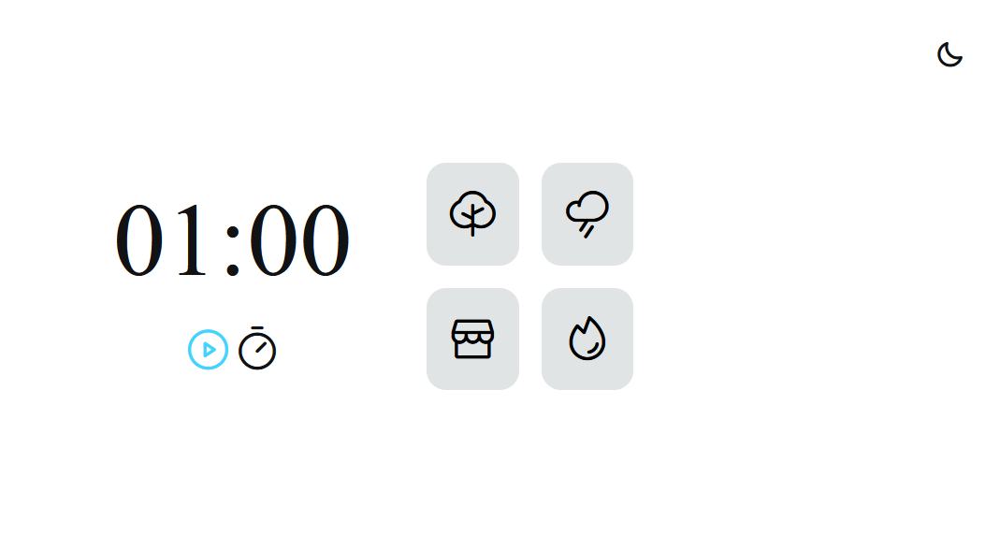
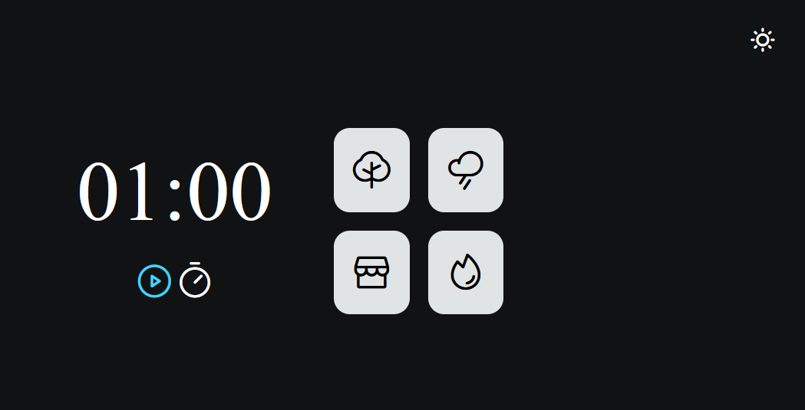

<h1 align="center"> <strong>Desafio Explorer Stage 5: Focus Timer II</strong> </h1>

Desafio para criação de um Timer, no qual o usuário pode informar qual o tempo no cronometo, também escutar músicas e mesclar elas. 

  

  

## Tecnologias

Desenvolvido com as seguintes tecnologias:

- HTML
- CSS
- Figma
- JavaScript
